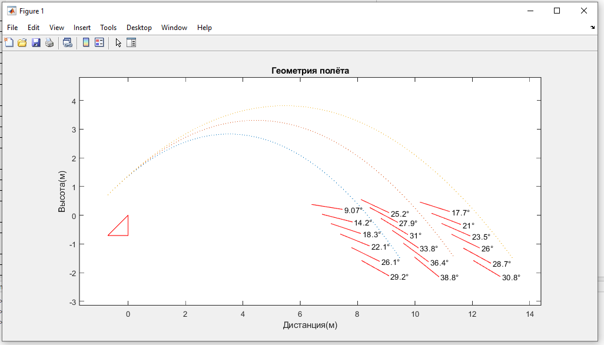
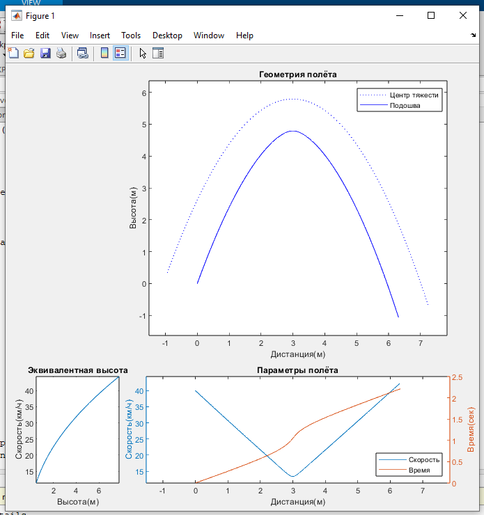
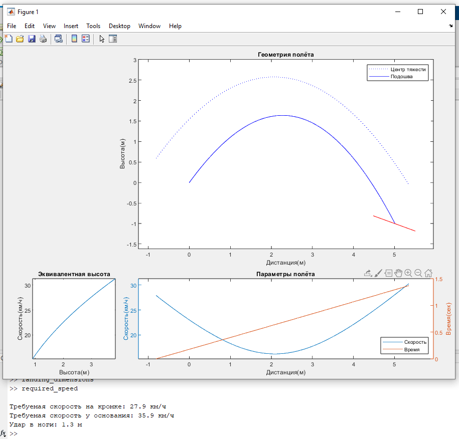

# Траектория трамплина

Несколько скриптов, показывающих параметры полётов на трамплине. По умолчанию значения
брались для велосипеда, но всякие лыжи/сноуборды можно обсчитывать без изменений.
Для реализации был выбран Simulink, т.к. он позволяет очень быстро моделировать физические
процессы без написания дифференциальных уравнений. Open-source аналогов для него я не
нашел, взял Matlab R2019b(возможно он есть на торрентах). У меня там установлены почти
все доп-пакеты, но скорее всего достаточно только самого Matlab и Simulink, тк
использовались самые распространенные блоки.
## Содержание
- [Размеры приземления](#размеры-приземления)
- [Подробные параметры полёта](#подробные-параметры-полёта)
- [Подбор требуемой скорости](#подбор-требуемой-скорости)

## Размеры приземления
Скрипт [landing_dimensions.m](landing_dimensions.m) рисующий требуемые углы и размеры
приземления для основной и ошибочных траекторий. В начале файла указывается угол вылета,
скорость, вероятная ошибка скорости и требуемые силы удара в ноги(как эквивалент дропа
на плоскач). Траектория отрисовывается для центра тяжести, его высоту над подошвой
можно изменить. Так же траектория ЦТ показывает куда и под каким углом воткнется
тушка райдера если не приземлить нормально - лишний повод подумать над дробящими и
фрикционными свойствами поверхности. В качестве точки (0,0) используется кромка трамплина,
длина красных черточек 1.1м - как база велосипеда.

Дополнительная фича - можно указать высоту трамплина. То есть ты измерил скорость рядом с
ним, а скрипт посчитал скорость на кромке через потерю кинетической энергии, без учета
сопротивления воздуха и трения подошвы(они скорее всего незначительные). Или указываем эту
высоту равной нулю.

## Подробные параметры полёта
Скрипт [flight_details.m](flight_details.m) выводящий подробно геометрию, скорость и
время для заданных параметров вылета. Подошва всегда отрисовывается параллельно
траектории ЦТ, из-за чего на больших углах иногда движется назад. Время всегда будет как
наклонная линия, т.к. горизонтальная скорость почти не меняется. График скорости и
времени соответствует положению ЦТ. Слева график чтобы понять падению с какой высоты
соответствует эта скорость.

## Подбор требуемой скорости
Скрипт [required_speed.m](required_speed.m), визуально очень похож на параметры полёта,
но тут за тебя автоматически подбирают требуемую скорость с точностью до 0.1 км/ч(точнее
вряд ли нужно) для заданного трамплина. Из вводимых параметров только углы вылета и
приземления, и расстояния между ними. Подошва здесь постепенно вращается от угла вылета
до угла приземления, в конце рисуется это самое приземление красной чертой.

Здесь сила удара в ноги вычисляется точнее, чем в "параметрах приземления" - помимо
встречной скорости учитывается ещё направление силы тяжести, которую приходится
преодолевать ногам. Я взял, что можно нормально спрыгнуть с 2х метров, ход ног и наклона 
получается ~1м, итого ты в рывке "поднимаешь" 3 своих массы - 2 на работу по погашению
кинетической энергии, и ещё одну чтобы просто держать себя. Значит если нужно приземлять
в вертикальную поверхность, то эквивалентная высота будет ощущаться в 1.5 раза меньше,
т.к. на погашение кинетической энергии тратится уже всё усилие в 3 массы вместо 2х. А
для угла 45° эквивалентную высоту можно умножить на 0.76. Если кажется, что ноги не могут
поднимать 3 массы, то скорее всего они и не поднимают - они сами весят как остальное
туловище, нагрузка приходит либо с меньшим рычагом, либо на более нижние суставы.

Для максимального удобства трамплин можно измерять лазерной рулеткой с встроенным
угломером, только убедиться что у неё нормальная точность и диапазоны измерений.
На момент написания текста я видел нормальные варианты косарей за 5 (90$).
В них часто встроена "функция Пифагора" - измеряешь две точки без смещения рулетки, и
она по углам и диагоналям сразу выдает тебе расстояние по горизонтали или вертикали между
точками.

