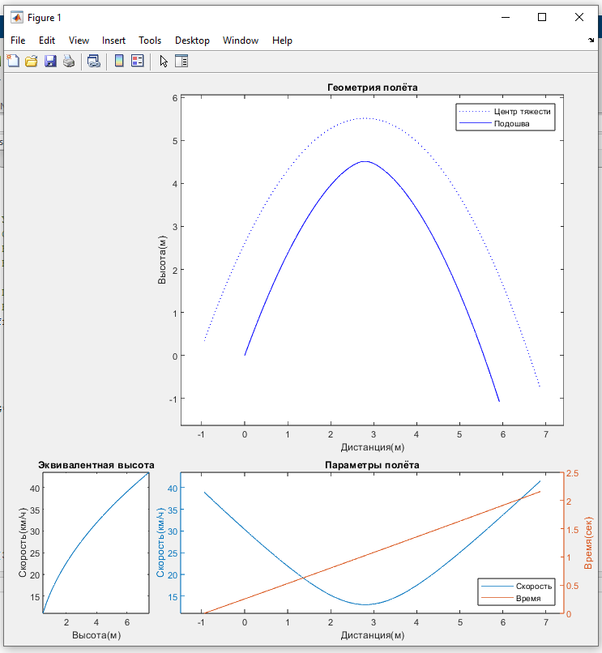

# Траектория трамплина

Несколько скриптов, показывающих параметры полётов на трамплине. По умолчанию значения
брались для велосипеда, но всякие лыжи/сноуборды можно обсчитывать без изменений.
Для реализации был выбран Simulink, т.к. он позволяет очень быстро моделировать физические
процессы без написания дифференциальных уравнений. Open-source аналогов для него я не
нашел, взял Matlab R2019b(возможно он есть на торрентах). У меня там установлены почти
все доп-пакеты, но скорее всего достаточно только самого Matlab и Simulink, тк
использовались самые распространенные блоки.
## Содержание
- [Размеры приземления](#размеры-приземления)
- [Подробные параметры полёта](#подробные-параметры-полёта)
- [Подбор требуемой скорости](#подбор-требуемой-скорости)
- [Всякие наблюдения](#всякие-наблюдения)
- [Технические подробности](#технические-подробности)

## Размеры приземления
Скрипт [landing_dimensions.m](utf8/landing_dimensions.m) рисующий требуемые углы и размеры
приземления для основной и ошибочных траекторий. В начале файла указывается угол вылета,
скорость, вероятная ошибка скорости и требуемые силы удара в ноги(как эквивалент дропа
на плоскач). Траектория отрисовывается для центра тяжести, его высоту над подошвой
можно изменить. Так же траектория ЦТ показывает куда и под каким углом воткнется
тушка райдера если не приземлить нормально - лишний повод подумать над дробящими и
фрикционными свойствами поверхности. В качестве точки (0,0) используется кромка трамплина,
длина красных черточек 1.1м - как база велосипеда.

Дополнительная фича - можно указать высоту трамплина. То есть ты измерил скорость
и разброс скоростей рядом с ним,
а скрипт посчитал скорость на кромке через потерю кинетической энергии, без учета
сопротивления воздуха и трения подошвы(они скорее всего незначительные). Или указываем эту
высоту равной нулю, если точно знаешь скорость на кромке.

## Подробные параметры полёта
Скрипт [flight_details.m](utf8/flight_details.m) выводящий подробно геометрию, скорость и
время для заданных параметров вылета. Подошва всегда отрисовывается параллельно
траектории ЦТ, из-за чего на больших углах иногда движется назад. Время всегда будет как
наклонная линия, т.к. горизонтальная скорость почти не меняется. График скорости и
времени соответствует положению ЦТ. Слева график чтобы понять падению с какой высоты
соответствует эта скорость.

## Подбор требуемой скорости
Скрипт [required_speed.m](utf8/required_speed.m), визуально очень похож на параметры полёта,
но тут за тебя автоматически подбирают требуемую скорость с точностью до 0.1 км/ч(точнее
вряд ли нужно) для заданного трамплина. Из вводимых параметров только углы вылета и
приземления, и расстояния между ними. Подошва здесь постепенно вращается от угла вылета
до угла приземления, в конце рисуется это самое приземление красной чертой.

Здесь сила удара в ноги вычисляется точнее, чем в "параметрах приземления" - помимо
встречной скорости учитывается ещё направление силы тяжести, которую приходится
преодолевать ногам. Я взял, что можно нормально спрыгнуть с 2х метров, ход ног и наклона 
получается ~1м, итого ты в рывке "поднимаешь" 3 своих массы - 2 на работу по погашению
кинетической энергии, и ещё одну чтобы просто держать себя. Значит если нужно приземлять
в вертикальную поверхность, то эквивалентная высота будет ощущаться в 1.5 раза меньше,
т.к. на погашение кинетической энергии тратится уже всё усилие в 3 массы вместо 2х. А
для угла 45° эквивалентную высоту можно умножить на 0.76. Если кажется, что ноги не могут
поднимать 3 массы, то скорее всего они и не поднимают - они сами весят как остальное
туловище, нагрузка приходит либо с меньшим рычагом, либо на более нижние суставы.

Для максимального удобства трамплин можно измерять лазерной рулеткой с встроенным
угломером, только убедиться что у неё нормальная точность и диапазоны измерений.
На момент написания текста я видел нормальные варианты косарей за 5 (90$).
В них часто встроена "функция Пифагора" - измеряешь две точки без смещения рулетки, и
она по углам и диагоналям сразу выдает тебе расстояние по горизонтали или вертикали между
точками.

## Всякие наблюдения

При помощи скрипта [test_dependencies.m](utf8/test_dependencies.m) с разными модификациями
нарисовал несколько графиков зависимостей.
На графике ниже определял зависимость дальности полёта от скорости, начальный угол полёта
во всех случаях 45°. Если просто кинуть камень в вакууме(верхняя линия), то дальность
пропорциональная квадрату скорости. На линии ниже добавили сопротивление воздуха и она
начала спрямляться. На больших скоростях зависимость вообще становится похожа на
логарифмическую, но сюда это не влезло. Далее, красная линия ниже - добавили ненулевую
высоту ЦТ над подошвой, теперь его надо перекинуть через кромку трамплина, и вся линия
сместилась вниз. На двух нижних линиях добавилась высота трамплина над местом, где
замеряли скорость - тут можно обратить внимание на наклон, с которым стартует линия. Если
на первых линиях разница между 0 и 5м полёта это окно в 25км/ч, то на последней это всего
8км/ч. Но из-за кинетической энергии на большей скорости проще эту самую скорость держать -
это как на машине ехать 100 км/ч, торможение и разгон даются большими усилиями.
  

Далее вопрос - как влияет ошибка в 1км/ч на дальность полёта? График строился для трамплина
высотой 2м и с углом вылета 45°. Чтобы предоставить райдеру возможность ошибки на 1км/ч
нужно увеличить приземление почти на метр. И если бы высота трамплина была 3м, то это был
бы тот же график, только срезанный правее - дальность полёта прямо пропорциональна джоулям
кинетической энергии которые ты донёс до кромки, и ошибку логичнее измерять в этих самых
джоулях.  

Следущим измерил влияние ошибки в угле вылета, на случай если мы его криво измерили
или подвеска сожрала пару градусов. На том же трамплине значения получились просто
исчезающе малыми, пришлось брать 3° вместо 1°. В целом получилась просто другая траектория
которая точно так же пропорциональна квадрату скорости.  

Тогда посмотрим как в целом угол вылета влияет на параметры, на скорости ~60км/ч.
Маленькая ошибка на прошлом графике объясняется тем, что возле 45° у дальности "плато".
Но кстати максимальная дальность где-то на 43-44° из-за сопротивления воздуха. В
артиллерии точно так же - самая большая дальность на углах меньше 45°, кроме
каких-нибудь сверхдальних вариантов, где наоборот угол больше, чтобы раньше выйти из
атмосферы.  

Для этого же трамплина 45° посмотрим влияние сопротивления воздуха на дальность полета. По
оси X теперь дальность полёта в вакууме, а по Y - сколько ты не долетишь из-за атмосферы.
Т.е. на 19м это всего 1 метр недолёта - большинство расчетов можно делать с простенькой
параболой, учитывая только ускорение свободного падения.  

## Технические подробности

Все скрипты строятся вокруг запуска simulink-модели flight_model.slx, входные параметры
приходят в неё как экспорт переменных из среды matlab(что например мешает запускать её
в цикле `parfor`, но мне лень переделывать). Посмотреть её содержимое можно на картинке
ниже:

Всякая рутина вроде разделения на составляющие(одну и ту же величину умножить на sin и
cos угла) вынес в подсистемы, чтобы не мозолили глаза. Блоки связанные с отрисовкой
подошвы можно по большому счёту выкидывать - они не прям чтобы нужны, её приходится
вращать в коде.
Здесь учитывается два воздействия - ускорение свободного падения(оно кстати разное на
разных широтах и высоте) и аэродинамическое замедление, параметры для которого задаются
в файле [aerodynamic_coefficient.m](utf8/includes/aerodynamic_coefficient.m). По умолчанию
аэродинамические параметры взяты для шоссера средней упитанности катающегося летом на
высоте Москвы.

Вообще изначально мне хотелось сделать трехмерный случай, где учитывается сила и
направление ветра, смещение от центра вылета и угол курса к оси вылета, и потом методом
Монте-Карло посмотреть пятно вариантов приземления, среднюю силу удара в ноги и т.п.
Но лень и здравый смысл победили, может как-нибудь потом.

Ещё одна из идей - можно с помощью simulink-coder транслировать модель в чистый Си, и
потом уже его использовать для написания какого-нибудь калькулятора траекторий либо под
андроид, либо вообще руками перевести в JS и сделать браузерную версию.

Потери на высоту трамплина можно вычислять точнее - сейчас просто берется потеря
кинетической энергии для заданной высоты(E=m*G*h), но из-за наклона трамплина разница
между ЦТ на кромке и ЦТ у основания будет чуть меньше.
